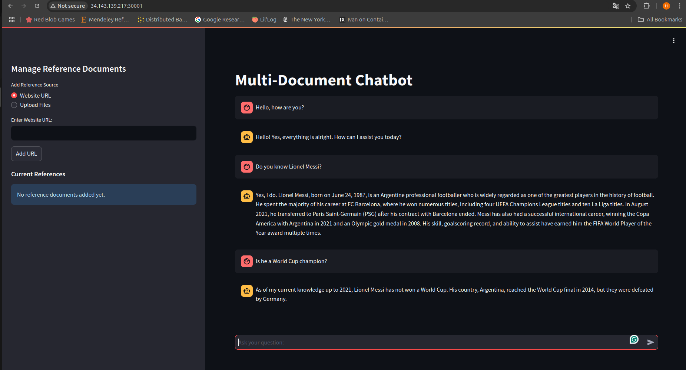
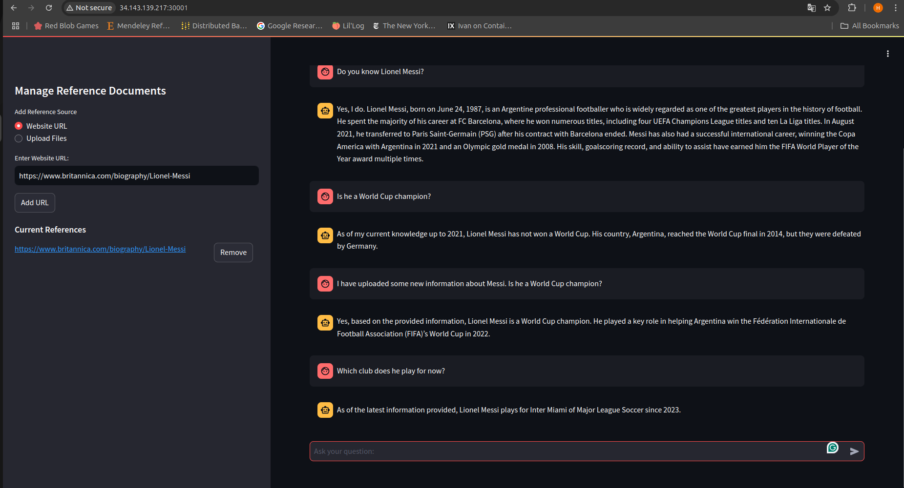
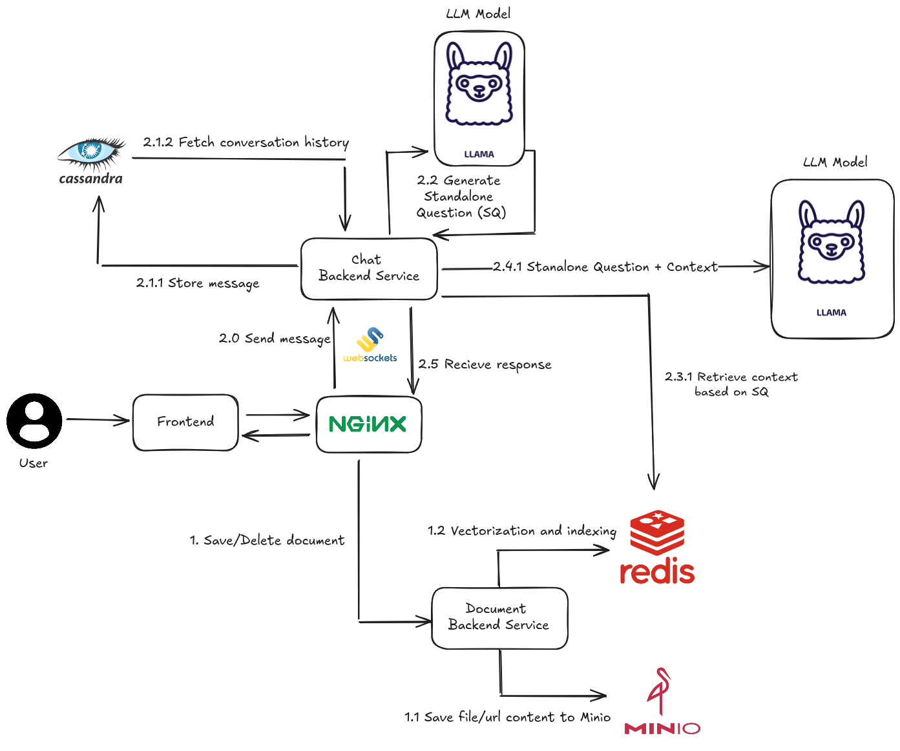
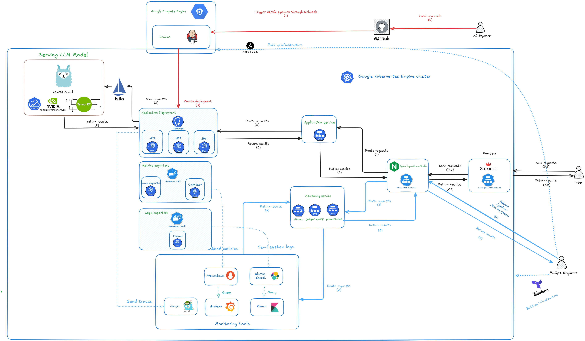
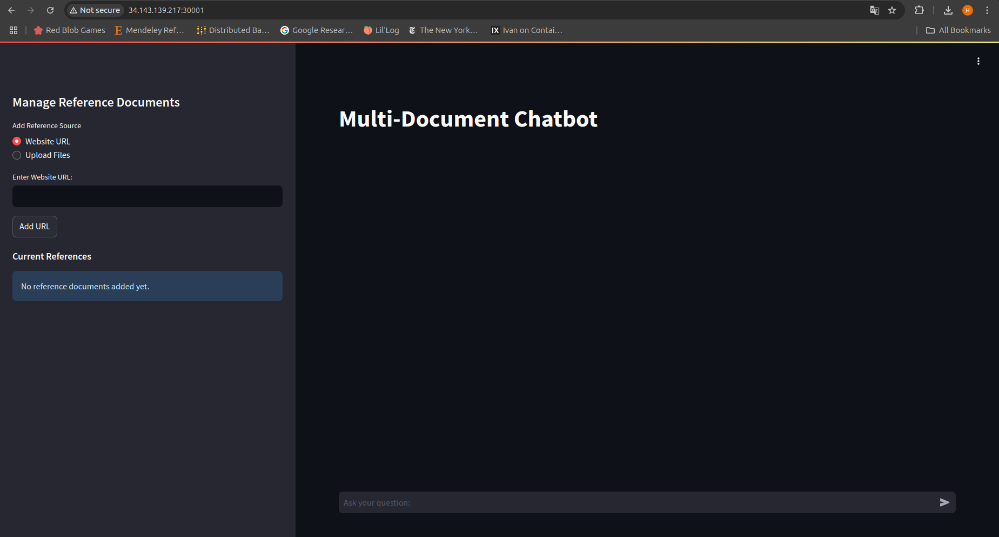
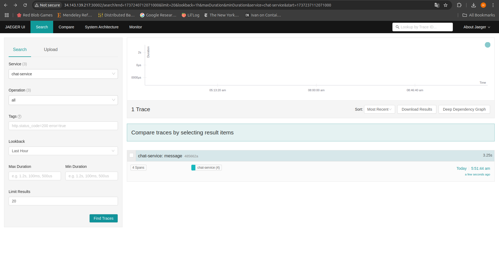
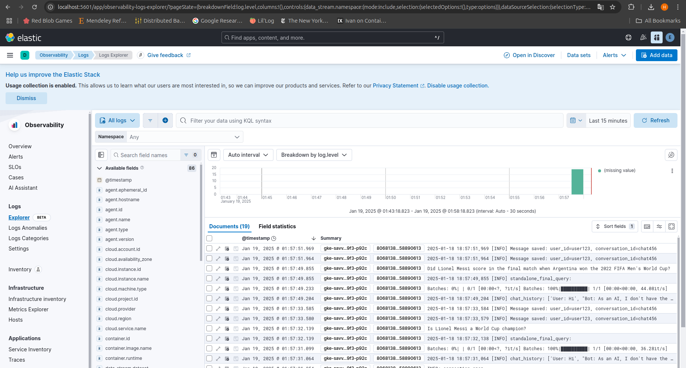
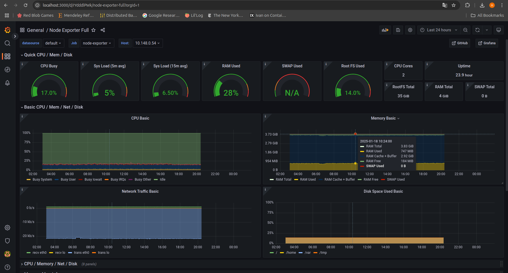

# 🤖 Chat With Your Documents: Stateful AI Chatbot

Welcome to **Chat With Your Documents**, an advanced stateful chatbot application designed to streamline document-based interactions. This application enables users to upload files 📁 or provide URLs 🌐 and engage in dynamic, context-aware conversations directly with their documents. Whether you're querying technical documentation, analyzing reports, or diving deep into research papers, this chatbot makes it effortless to extract insights and knowledge.

## ✨ Key Features

- **🤝 Stateful Conversations**: Maintain the context of your queries for more intelligent and coherent interactions.
- **📄 Retrieval-Augmented Generation System**: Seamlessly upload files or provide URLs to enable dynamic, context-aware conversations with your documents by leveraging retrieval-augmented generation techniques.
- **🚀 Google Kubernetes Deployment**: Deployed seamlessly on Google Kubernetes Engine (GKE) for scalable and robust operations.
- **🔄 CI/CD Integration**: Equipped with a Continuous Integration and Continuous Deployment (CI/CD) pipeline to ensure fast, reliable updates and maintenance. *(In progress...)*

This repository contains all the resources you need to deploy, customize, and use the application effectively. Dive into the sections below to get started! 🚀

## 🌟 Demo

<p align="center">
  
</p>
<p align="center">
  <strong>Figure 1.</strong> Demo of the Chatbot Without External Knowledge
</p>

<p align="center">
  
</p>
<p align="center">
  <strong>Figure 2.</strong> Demo of the Chatbot After Adding External Knowledge via the RAG System
</p>


## 🌟 System Overview

<p align="center">
  
</p>
<p align="center">
  <strong>Figure 3.</strong> System Overview.
</p>

---

### 📄 RAG - System

- **Document Upload**: 🗂️ Users can upload their documents (including files or URLs) to the chatbot. The content from these files or URLs is saved in **MinIO** for further processing.
  
- **Vectorization**:
  - **🔍 Semantic Chunking**: Documents are split into smaller, meaningful chunks using semantic chunking techniques. Semantic chunking ensures that each segment of the document preserves contextual relevance, making it easier to retrieve and understand. For example, sections, paragraphs, or logical groupings of information are treated as distinct chunks.
  - **📦 Embedding and Storage**: Each chunk is converted into embeddings (vector representations) and stored in **Redis Vector Database** for efficient similarity-based retrieval during queries.

---

### 💬 Chat System

- **User Session**:
  - **🔗 Stateful Connection**: A WebSocket connection is established between the user and the server to maintain a stateful session.
  - **📜 Historical Context**: At the start of the session, historical conversation data is fetched from **Cassandra** to provide the chatbot with contextual knowledge of past interactions. This allows the chatbot to respond more effectively by considering previous queries and answers.
  - **📈 Incremental Updates**: WebSockets enable real-time, incremental updates to the historical conversation data, ensuring the context is always up-to-date.

- **Message Processing**:
  - **🛠️ Standalone Question Creation**: Each user message, along with its historical context, is processed to generate a **standalone question** using OpenAI. The standalone question is reformulated to be independent of previous interactions, improving both context retrieval and input clarity for the LLM.
  - **Example**:
    ```
    User: Do you know Elon Musk?
    Bot: Yes, I know him.
    User: Is HE the richest man in the world?
    ```
    **Standalone Question**: *Is Elon Musk the richest man in the world?*

- **📚 Context Retrieval**:
  - The embedding of the standalone question is used to query the **Redis Vector Database**, retrieving relevant chunks of external context.

- **🧠 Response Generation**:
  - The standalone question and the retrieved context are sent to the **OpenAI API** to generate a response.
  - The user’s question and the chatbot's response are then stored in **Cassandra** to update the conversation history.

This system architecture ensures accurate, context-aware responses and efficient handling of document-based queries. 🚀

---

## 🚀 Getting Started

Follow these steps to set up and run the application:

1. **Clone the repository**:
   ```bash
   git clone https://github.com/nhduong1203/LLM-Chatbot
   ```

2. **Navigate to the project directory**:
   ```bash
   cd LLM-Chatbot
   ```

3. **Set the root directory environment variable** (for easier navigation):
   ```bash
   export ROOT_DIR=$(pwd)
   ```

---

## 🚀 Application Deployment

<p align="center">
  
</p>
<p align="center">
  <strong>Figure 4.</strong> GKE Deployment Overview.
</p>

### 1.1 Build Application Image

1. Create a new `.env` file based on `.env.example` and populate the variables there:
   ```bash
   cd $ROOT_DIR
   set -a && source .env && set +a
   ```

2. Build the application images:
   ```bash
   docker-compose build --no-cache
   ```

3. After building the images, tag and push the image to your Docker Hub repository. For example:
   ```bash
   docker tag backend-chat:latest $DOCKER_USERNAME/backend-chat:latest
   docker push $DOCKER_USERNAME/backend-chat:latest
   ```

---

### 1.2 Deploy to GKE

#### 1.2.1 Setup

1. **Install Required Tools**:
   - [kubectl](https://kubernetes.io/docs/tasks/tools/install-kubectl/) - For communicating with the Kubernetes API server.
   - [kubectx and kubens](https://github.com/ahmetb/kubectx) - For easier navigation between clusters and namespaces.
   - [Helm](https://helm.sh/docs/intro/install/) - For managing templating and deployment of Kubernetes resources.

2. **Create a GKE Cluster using Terraform**:
   - Log in to the GCP Console and create a new project.
   - Update the `project_id` in `terraform/variables.tf`:
     ```hcl
     variable "project_id" {
       description = "The project ID to host the cluster in"
       default     = "your-project-id"
     }

     variable "region" {
       description = "The region for the cluster"
       default     = "asia-southeast1-a"
     }
     ```

3. **Log in to GCP using the gcloud CLI**:
   ```bash
   gcloud auth application-default login
   ```

4. **Provision a new GKE cluster using Terraform**:
   ```bash
   cd $ROOT_DIR/iac/terraform
   terraform init
   terraform plan
   terraform apply
   ```

5. **Connect to the GKE Cluster**:
   ```bash
   gcloud container clusters get-credentials $CLUSTER_NAME --region $REGION --project $PROJECT_ID
   ```

6. **Switch to the GKE Cluster Context**:
   ```bash
   kubectx gke_${PROJECT_ID}_${REGION}_${CLUSTER_NAME}
   ```

---

#### 1.2.2 Deployment

1. Navigate to the `k8s-yaml` folder:
   ```bash
   cd $ROOT_DIR/k8s-yaml
   ```

2. Deploy each service by applying its corresponding YAML file. For example:
   ```bash
   cd db
   kubectl apply -f minio.yaml
   ```

3. Repeat the process for all other services in their respective folders by navigating to the folder and running:
   ```bash
   kubectl apply -f {service-name}.yaml
   ```

4. Create a Secret: store the OpenAI API key in a Kubernetes secret:
    ```bash
    kubectl create secret generic openai-api-key --from-literal=OPENAI_API_KEY=<your_openai_api_key>
    ```
**Note:** To deploy Cassandra, first run `cassandra-deployment.yaml` to start Cassandra. Then, run `cassandra-init-job.yaml` to initialize the keyspace, tables, and other required configurations.

---

## 📄 Instances in My GKE Cluster

Due to the limitations of GCP's free trial tier, I am unable to use instances with GPUs. As a result, certain machine learning models in this cluster will run on CPU. Below is the configuration of the instances in my cluster:

| **Resource**                     | **Name**                           | **Machine Type** | **Disk Size (GB)** | **Preemptible** | **Labels**               | **Min Nodes** | **Max Nodes** | **Node Count** | **Workload**           |
| -------------------------------- | ---------------------------------- | ---------------- | ------------------ | --------------- | ------------------------ | ------------- | ------------- | -------------- | ---------------------- |
| **GKE Cluster**                  | `gke`            | N/A              | N/A                | N/A             | N/A                      | N/A           | N/A           | 1              | Cluster Management     |
| **System Services Node Pool**    | `sys-svc-pool`   | e2-standard-2    | 40                 | No              | workload=system-services | 1             | 3             | 1              | MinIO and Redis        |
| **Cassandra Node Pool**          | `cassandra-pool` | e2-highmem-4     | 40                 | No              | workload=cassandra       | 1             | 2             | 1              | Cassandra Database     |
| **Backend Doc Node Pool**        | `doc-pool`       | e2-standard-4    | 40                 | No              | workload=backend-doc     | 1             | 2             | 1              | Backend Doc Management |
| **Backend Chat Node Pool**       | `chat-pool`      | e2-standard-4    | 40                 | No              | workload=backend-chat    | 1             | 2             | 1              | Backend Chat Service   |
| **Frontend and NGINX Node Pool** | `fe-pool`        | e2-medium        | 40                 | Yes             | workload=frontend        | 1             | 1             | 1              | Frontend & NGINX       |
| **LLM Node Pool** | `llm-pool`        | g2-standard-12 (L4 GPU)       | 150              | Yes             | workload=llm        | 1             | 1             | 1              | LLM      |

This completes the setup and deployment of the chatbot application on GKE. 🎉
With NodePort Service, you can access the frontend from the external IP of a node.
<p align="center">
  
</p>
<p align="center">
  <strong>Figure 5.</strong> Access frontend via Node's External IP.
</p>

## Observability

So far, we have deployed the model and the FastAPI app to GKE. Now, we need to monitor the performance of the model and the app. We will use Prometheus and Grafana for monitoring the model and the app, Jaeger for tracing the requests, and Elasticsearch and Kibana for collecting system logs. Let's get started!

1. Increase inotify watch limits for Kubernetes instances.
    
    ```shell
    cd $ROOT_DIR/observability/inotify
    kubectl apply -f inotify-limits.yaml
    ```
    
2. Create a separate namespace for observability and switch to it.

    ```shell
    kubectl create namespace observability
    kubens observability
    ```

3. Install Jaeger for tracing the application.

    ```shell
    cd $ROOT_DIR/k8s-yaml
    kubectl apply -f jaeger.yaml
    ```

4. Install the ELK stack for collecting logs.

    ```shell
    # Install ECK operator
    cd $ROOT_DIR/observability/elasticcloud/deploy/eck-operator
    kubectl delete -f https://download.elastic.co/downloads/eck/2.13.0/crds.yaml
    kubectl create -f https://download.elastic.co/downloads/eck/2.13.0/crds.yaml
    kubectl apply -f https://download.elastic.co/downloads/eck/2.13.0/operator.yaml
    # Install ELK stack
    cd $ROOT_DIR/observability/elasticcloud/deploy/eck-stack
    kubectl get serviceaccount filebeat -n elk &> /dev/null && kubectl delete serviceaccount filebeat -n elk || true
    kubectl get clusterrolebinding filebeat -n elk &> /dev/null && kubectl delete clusterrolebinding filebeat -n elk || true
    kubectl get clusterrole filebeat -n elk &> /dev/null && kubectl delete clusterrole filebeat -n elk || true
    helm upgrade --install elk -f values.yaml .
    ```

5. Install Prometheus and Grafana for monitoring the system.

    ```shell
    cd $ROOT_DIR/observability/metric
    yq e '.data."config.yml" |= sub("webhook_url: .*", "webhook_url: env(DISCORD_WEBHOOK_URL)")' -i charts/alertmanager/templates/configmap.yaml 
    helm upgrade --install prom-graf . --namespace observability
    ```

6. Access the monitoring tools:

   6.1. **Jaeger**:
   - Forward port:
   ```shell
   nohup kubectl port-forward svc/jaeger-query 16686:80 > port-forward.log 2>&1 &
   ```
   - Access via: [http://localhost:16686](http://localhost:16686) or node's external-IP
<p align="center">
  
</p>
<p align="center">
  <strong>Figure 6.</strong> Tracing from Jaeger.
</p>

   6.2. **Kibana**:
   - Forward port:
    ```shell
    nohup kubectl port-forward -n observability svc/elk-eck-kibana-kb-http 5601:5601 > /dev/null 2>&1 &
    ```
   - Access Kibana at: [http://localhost:5601](http://localhost:5601)
   - Get the password for the `elastic` user:
     ```shell
     kubectl get secret elasticsearch-es-elastic-user -n observability -o jsonpath='{.data.elastic}' | base64 -d
     ```
<p align="center">
  
</p>
<p align="center">
  <strong>Figure 7.</strong> Kibana Logging.
</p>


   6.3. **Grafana**:
   - Forward port:
     ```shell
     nohup kubectl port-forward -n observability svc/grafana 3000:3000 > /dev/null 2>&1 &
     ```
   - Access Grafana at: [http://localhost:3000](http://localhost:3000)
   - Login with:
     ```
     username: admin
     password: admin
     ```
   - Check for metrics.
<p align="center">
  
</p>
<p align="center">
  <strong>Figure 8.</strong> Metric from Grafana.
</p>


# Serving LLM Model using TensorRT-LLM, Triton Inference Server, and KServe

## ⚙️ Building TensorRT-LLM Engine

### 💡 TensorRT-LLM Introduction
TensorRT-LLM is an optimized library developed by NVIDIA for accelerating large language model (LLM) inference on GPUs. It leverages TensorRT's highly efficient kernel fusion, precision calibration, and multi-GPU scaling to provide fast and memory-efficient execution.

For this project, we will use `meta-llama/Llama-3.1-8B-Instruct` as our LLM model.

### 🏡 Creating a Google Persistent Disk to Store the TensorRT-LLM Engine Output

**Create a Disk**
```sh
gcloud compute disks create my-disk \
    --size=150GB \
    --type=pd-ssd \  
    --zone=CLUSTER_ZONE
```

**Attach the disk to the GPU instance**
```sh
gcloud compute instances attach-disk GPU_INSTANCE \
    --disk=my-disk \
    --zone=CLUSTER_ZONE
```

**Format the Disk (if needed)**

If the newly created disk does not have a filesystem, format it first. SSH into the GPU instance and run:

```sh
sudo mkfs.ext4 /dev/sdb
```

**Mount the Disk**

Choose a directory to mount the disk, e.g., /mnt/models:

```sh
sudo mkdir -p /mnt/models
sudo mount /dev/sdb /mnt/models
```

### 🔨 Building the TensorRT-LLM Engine

This process requires GPUs. SSH into the GPU instance before proceeding.

**Clone TensorRT-LLM Repository**
```sh
git clone https://github.com/NVIDIA/TensorRT-LLM.git
cd TensorRT-LLM
git submodule update --init --recursive
git lfs pull
cd examples/llama
pip install --upgrade -r requirements.txt --extra-index-url https://pypi.nvidia.com
```

**Download Llama Model**
```sh
huggingface-cli login
huggingface-cli download meta-llama/Llama-3.1-8B-Instruct --local-dir ./checkpoints/
```

The model will be stored in `TensorRT-LLM/examples/llama/checkpoints/Llama-3.1-8B-Instruct`

**Convert Model to TensorRT-LLM Format**
```sh
python convert_checkpoint.py --model_dir ./checkpoints/Llama-3.1-8B-Instruct \
                              --output_dir ./tmp \
                              --dtype float16
```


**Build TensorRT-LLM Engine**
```sh
trtllm-build --checkpoint_dir ./tmp \
             --output_dir ./engines \
             --gemm_plugin float16 \
             --max_batch_size 1 \
             --max_num_tokens 4096 \
             --max_input_len 16384 \
             --max_seq_len 16384 \
             --max_beam_width 3 \
             --reduce_fusion enable \
             --multiple_profiles enable \
             --use_paged_context_fmha enable
```

The TensorRT-LLM engine will be stored at TensorRT-LLM/examples/llama/engines

**Copy the model and engine to GPD**
```sh
cp -r TensorRT-LLM/examples/llama/checkpoints/Llama-3.1-8B-Instruct /mnt/models/
cp -r TensorRT-LLM/examples/llama/engines /mnt/models/
```


### Create `run_triton.sh`

This script is responsible for running the Triton TensorRT-LLM backend.

```sh
cd /mnt/models/

cat << 'EOF' > run_triton.sh
#!/bin/sh

set -e

export TRT_BACKEND_DIR=/root/tensorrtllm_backend

echo "Cloning tensorrtllm_backend..."
if [ -d "$TRT_BACKEND_DIR" ]; then
  echo "Directory $TRT_BACKEND_DIR exists, skipping clone."
else
  cd /root
  git clone -b v0.12.0 https://github.com/triton-inference-server/tensorrtllm_backend.git
  cd $TRT_BACKEND_DIR
  git lfs install
  git lfs pull
fi

# Configure model
echo "Configuring model..."
cd $TRT_BACKEND_DIR
cp -r all_models/inflight_batcher_llm/ llama_ifb

export HF_LLAMA_MODEL=/mnt/models/Llama-3.1-8B-Instruct/
export ENGINE_PATH=/mnt/models/engines/

python3 tools/fill_template.py -i llama_ifb/preprocessing/config.pbtxt tokenizer_dir:${HF_LLAMA_MODEL},triton_max_batch_size:64,preprocessing_instance_count:1
python3 tools/fill_template.py -i llama_ifb/postprocessing/config.pbtxt tokenizer_dir:${HF_LLAMA_MODEL},triton_max_batch_size:64,postprocessing_instance_count:1
python3 tools/fill_template.py -i llama_ifb/tensorrt_llm_bls/config.pbtxt triton_max_batch_size:64,decoupled_mode:False,bls_instance_count:1,accumulate_tokens:False,logits_datatype:TYPE_FP32
python3 tools/fill_template.py -i llama_ifb/ensemble/config.pbtxt triton_max_batch_size:64,logits_datatype:TYPE_FP32
python3 tools/fill_template.py -i llama_ifb/tensorrt_llm/config.pbtxt triton_backend:tensorrtllm,triton_max_batch_size:64,decoupled_mode:False,max_beam_width:1,engine_dir:${ENGINE_PATH},max_tokens_in_paged_kv_cache:2560,max_attention_window_size:2560,kv_cache_free_gpu_mem_fraction:0.5,exclude_input_in_output:True,enable_kv_cache_reuse:False,batching_strategy:inflight_fused_batching,max_queue_delay_microseconds:0,encoder_input_features_data_type:TYPE_FP16,logits_datatype:TYPE_FP32

# Run Triton Server
echo "Running Triton Server..."
pip install SentencePiece
tritonserver --model-repository=$TRT_BACKEND_DIR/llama_ifb --http-port=8080 --grpc-port=9000 --metrics-port=8002 --disable-auto-complete-config --backend-config=python,shm-region-prefix-name=prefix0_
EOF

```

This completes the setup for building, storing, and running the TensorRT-LLM engine with Triton Inference Server.


### 🛠️ Create PV/PVC for Google Persistent Disk
We will create a PersistentVolume (PV) and PersistentVolumeClaim (PVC) to bind our GPD so that the upcoming Pod can use TensorRT-LLM engine.

```sh
kubectl apply -f- << EOF
apiVersion: v1
kind: PersistentVolume
metadata:
  name: gke-pd-pv
spec:
  capacity:
    storage: 150Gi  
  accessModes:
    - ReadWriteOnce
  persistentVolumeReclaimPolicy: Retain
  storageClassName: standard
  gcePersistentDisk:
    pdName: my-disk
    fsType: ext4
EOF

kubectl apply -f- << EOF
apiVersion: v1
kind: PersistentVolumeClaim
metadata:
  name: gke-pd-pvc
spec:
  accessModes:
    - ReadWriteOnce
  resources:
    requests:
      storage: 150Gi
  storageClassName: standard
EOF
```


## 🌐 Serving with Triton Backend and KServe

### 💡 Introduction

**Triton Inference Server** developed by NVIDIA, is an open-source tool optimized for deploying AI models efficiently on GPUs. It supports multiple frameworks and features like dynamic batching and concurrent execution, making it ideal for large-scale inference.

**KServe** is a Kubernetes-native solution for serving ML models at scale. It simplifies model deployment with auto-scaling, multi-framework support, and seamless integration with inference engines like Triton.

To install KServe on your Google Kubernetes Engine (GKE) cluster, follow the official tutorial: [Install KServe on GKE](https://kserve.github.io/website/master/admin/serverless/serverless/#4-install-kserve)

### 🕹️ Create a ClusterServerRuntime

```sh
kubectl apply -f- <<EOF
apiVersion: serving.kserve.io/v1alpha1
kind: ClusterServingRuntime
metadata:
  name: triton-trtllm
spec:
  annotations:
    prometheus.kserve.io/path: /metrics
    prometheus.kserve.io/port: "8002"
  containers:
  - args:
    - tritonserver
    - --model-store=/mnt/models/
    - --grpc-port=9000
    - --http-port=8080
    - --allow-grpc=true
    - --allow-http=true
    image: nvcr.io/nvidia/tritonserver:25.01-trtllm-python-py3
    name: kserve-container
    resources:
      requests:
        cpu: "4"
        memory: 12Gi
  protocolVersions:
  - v2
  - grpc-v2
  supportedModelFormats:
  - name: triton
    version: "2"
EOF

```

**ClusterServingRuntime** in KServe is a configuration that defines how to deploy and manage model inference services in a Kubernetes cluster. It allows users to specify resource limits, scaling behavior, and health checks for model serving.

For LLM inference with TensorRT-LLM, a dedicated runtime environment is configured using ClusterServingRuntime. It includes ECI-related annotations (e.g., k8s.aliyun.com/eci-use-specs for specifying GPU instance types and k8s.aliyun.com/eci-auto-imc for enabling ImageCache) to ensure efficient execution on GPU-accelerated Elastic Container Instances (ECI).

**Note:** Check your based image (and choose another image if needed) at  [Triton Server](https://catalog.ngc.nvidia.com/orgs/nvidia/containers/tritonserver/layers) to ensure it uses the same tensorrt_llm version as the one used to build your engine.

### 🌐 Deploy Kserve application

```sh
kubectl apply -f- << EOF
apiVersion: serving.kserve.io/v1beta1
kind: InferenceService
metadata:
 name: llama
spec:
  predictor:
    model:
      modelFormat:
        name: triton
        version: "2"
      runtime: triton-trtllm
      storageUri: pvc://gke-pd-pvc/
      name: kserve-container
      resources:
        limits:
          nvidia.com/gpu: "1"
        requests:
          cpu: "4"
          memory: 12Gi
          nvidia.com/gpu: "1"
      command:
      - sh
      - -c
      - /mnt/models/run_triton.sh
EOF
```


**InferenceService** is a key CRD in KServe that is used to define and manage AI inference services in a cloud-native environment. In the preceding InferenceService, the runtime field is used to bind the preceding ClusterServingRuntime, and storageUri is used to declare the PVC where the model and the model compilation script are located.

You can check whether the application is ready by executing the following command.

```sh
kubectl get isvc llama
```


### 🌐 Access the application

After the LLM inference service is ready, you can obtain the IP address of the ASM gateway and access the LLM service through the gateway. You also need to store this IP address in your environment file under the `ASM_GATEWAY_IP` key.

```sh
ASM_GATEWAY_IP=`kubectl -n istio-system get svc istio-ingressgateway -ojsonpath='{.status.loadBalancer.ingress[0].ip}'`

curl -H "Host: llama.default.example.com" -H "Content-Type: application/json" \
http://$ASM_GATEWAY_IP:80/v2/models/ensemble/generate \
-d '{"text_input": "Who is considered the greatest basketball player of all time?", "max_tokens": 30, "bad_words": "", "stop_words": "", "pad_id": 2, "end_id": 2}'
```


Expected output:

```
{
  "context_logits": 0.0,
  "cum_log_probs": 0.0,
  "generation_logits": 0.0,
  "model_name": "ensemble",
  "model_version": "1",
  "output_log_probs": [0.0, 0.0, 0.0, 0.0, 0.0, 0.0, 0.0, 0.0, 0.0, 0.0, 0.0, 0.0, 0.0, 0.0, 0.0, 0.0, 0.0, 0.0, 0.0, 0.0, 0.0, 0.0, 0.0, 0.0, 0.0, 0.0, 0.0, 0.0, 0.0, 0.0],
  "sequence_end": false,
  "sequence_id": 0,
  "sequence_start": false,
  "text_output": "Many consider Michael Jordan the greatest basketball player of all time due to his six NBA championships."
}
```

